# Dashboard visualization
## Summary
#### This is an exercise to demonstrate our skill in creating interactive data visualization dashboard using Plotly in JavaScript. The D3 library is also utilized to create the dashboard as a web application. The app is deployed at the following link-

#### The interactive dashboard app explores the human Belly Button Biodiversity dataset that catalogs the microbes that colonize human navels.The datasets acquired in a study reveals that a small handful of microbial species called operational taxonomic units (OTUs) were present in more than 70% of the population while other known microbes were relatively rare.

### 1. D3 library was imported and used to read the data from the URL. The  following data were retrieved.
 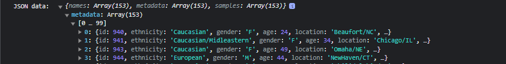
 
 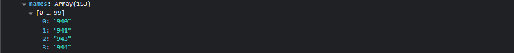
 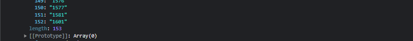
 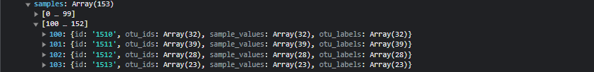
 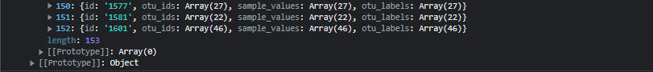

 ### 2. An interactive horizontal bar chart was created showing the top 10 OTUs. The chart updates and reflects the dataset of the 'id' selected from the dropdown menu.
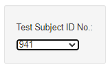
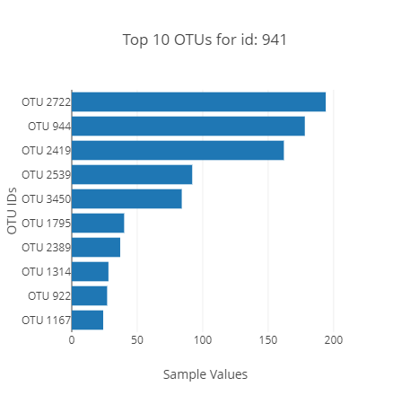
#### With hovering activated:
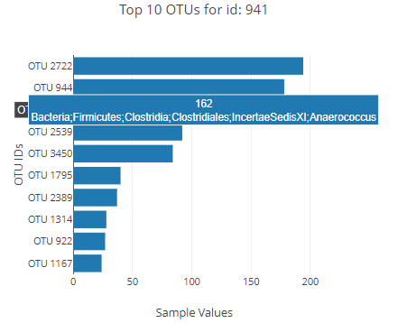

### 3. An interactive bubble chart was created. The graph with hovering activated is shown for a selected 'sample id' from the dropdown menu.
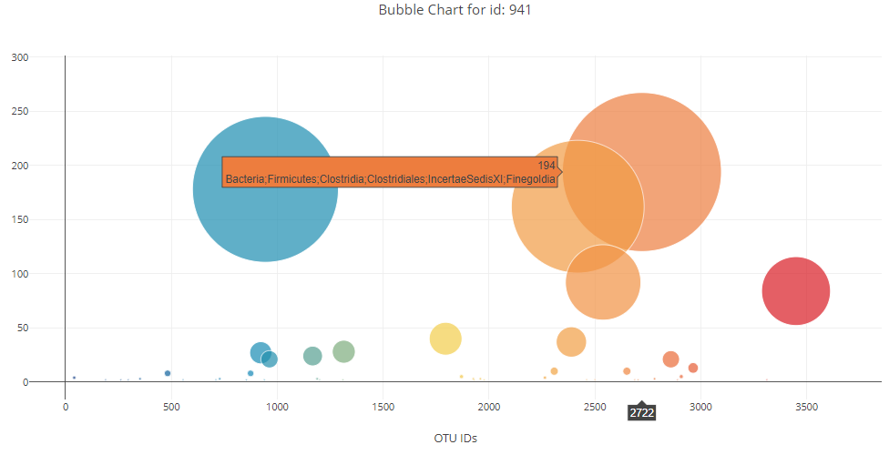

### 4. A sample's metadata is retrieved from the console log.
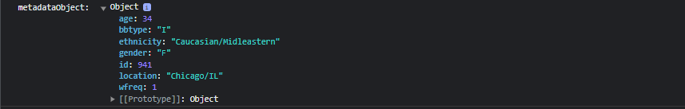

### 5. Display the Demographic info of a 'selected id' on the page.
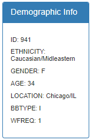

### 6. The consolidated dashboard 
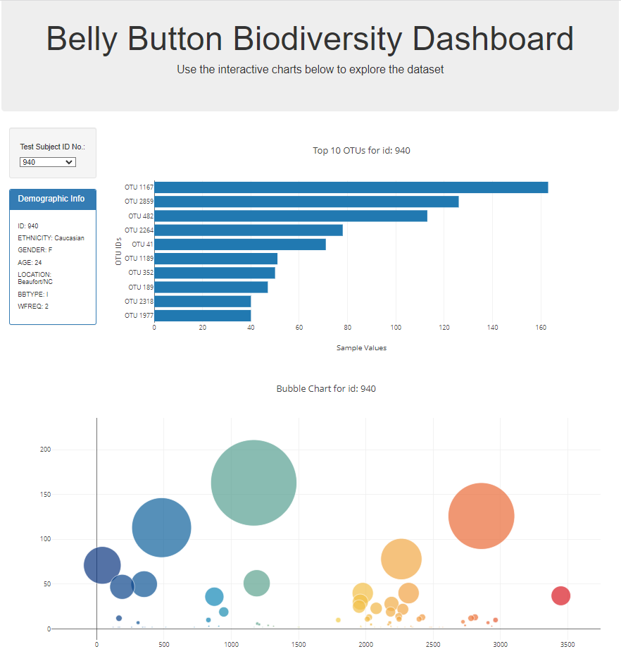

#### NOTE: I have worked on the interactive dashboard implementation by myself. I consulted with a learning assistant a couple of times. The results are saved in a sub-folder called 'Results'.